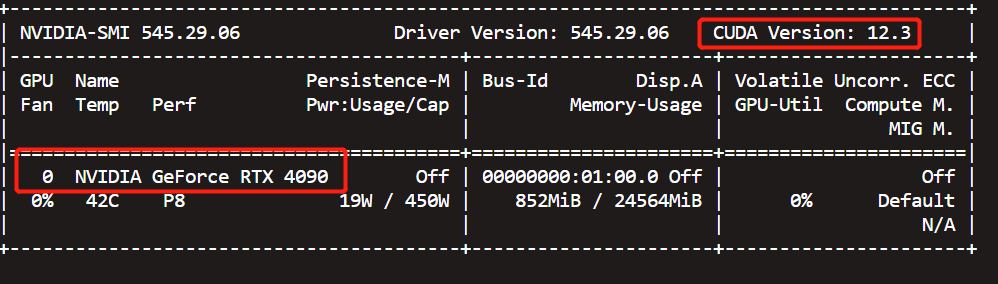
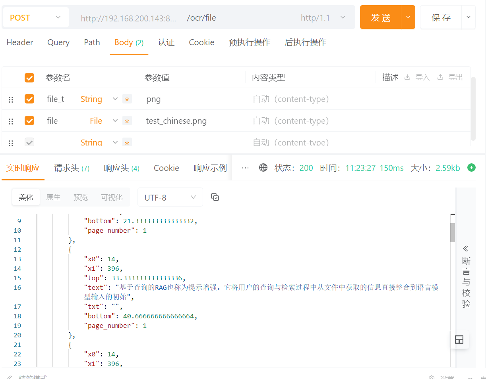

# OCRIntegrator
封装开源的OCR模型，表格检测，布局识别等能力，以统一接口方式提供服务。 目前只集成了deepdoc,后续会提供更多的服务集成

## Introduce
1. deepdoc中使用pdfplumber读取文本，同时使用OCR识别文字，优先取pdfplumber中的文本，扫描件则完全使用OCR识别的文本。
## 🎬 Get Started
### 📝 Prerequisites
* python >= 3.11  建议使用conda
* GPU > 2G
* tensorrt == 10.0.1  
* CUDA == 12.3  (理论上其他版本也可以，但没有实测过)
### 运行环境
1. python11，建议使用conda安装
2. 安装poetry,
   ```shell
    curl -sSL https://install.python-poetry.org | python3 -
    ```
3. 使用poetry安装依赖
    `poetry install `
4. 项目运行
    `uvicorn main:app`

### GPU下需要安装tensorrt运行
1. 安装tensorrt, 注意需要根据cuda版本修改tensorrt-cu12的名称。
   ```shell
   pip install tensorrt==10.0.1
   pip install tensorrt-cu12==10.0.1
   ```
下面是我的环境截图，可以参考




## DEMO


## 接口文档
启动后可以通过文档查看使用方法
http://localhost:8000/docs
