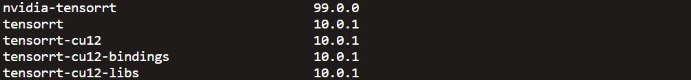

- zh_CN [简体中文](README.zh.md)
- en [English](README.md)
# OCRIntegrator
Encapsulates open-source OCR models, table detection, layout recognition, and other capabilities, 
providing services through a unified interface. Currently, only deepdoc is integrated, 
with more services to be integrated in the future.

## Introduce
1. In deepdoc, pdfplumber is used to read text, while OCR is used to recognize text.
    The text from pdfplumber is preferred, and OCR is used entirely for scanned documents.
## 🎬 Get Started
### 📝 Prerequisites
* python >= 3.11  (recommended to use conda)
* GPU > 6G
* tensorrt == 10.0.1  
* CUDA == 12.3  (other versions may work theoretically, but have not been tested)
* pycuda == 2024.1
### 运行环境
1. Install Python 3.11, recommended to use conda.
2. Install poetry:
   ```shell
    curl -sSL https://install.python-poetry.org | python3 -
    ```
3. Install dependencies using poetry:
    `poetry install `
4. Run the project:
    `uvicorn main:app`

### Running with GPU requires installing TensorRT
1. Install TensorRT, note that the name of tensorrt-cu12 needs to be modified according to the CUDA version.
   ```shell
   pip install tensorrt==10.0.1
   pip install tensorrt-cu12==10.0.1
   ```
2. Install pycuda
    ```shell
    pip install pycuda == 2024.1
    ```
Below are screenshots of my environment for reference:




## DEMO


## API Documentation
After starting, you can view the usage methods through the documentation: http://localhost:8000/docs
http://localhost:8000/docs
